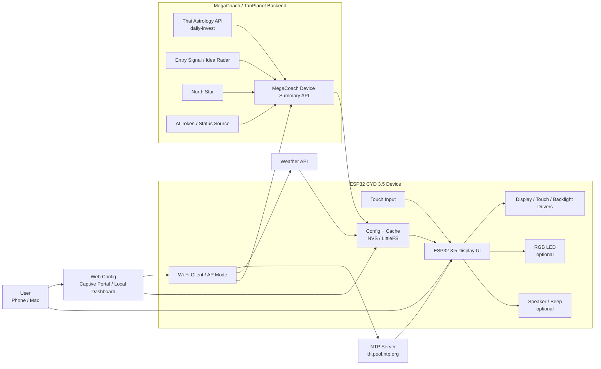
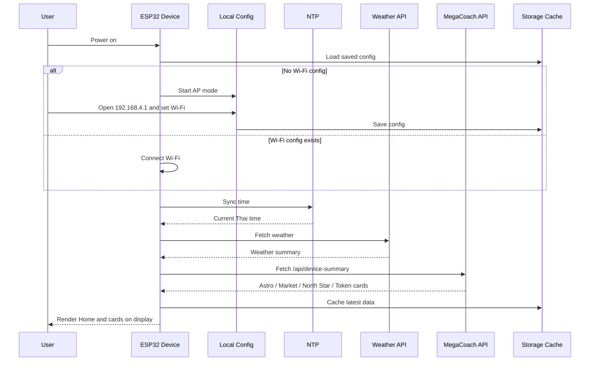
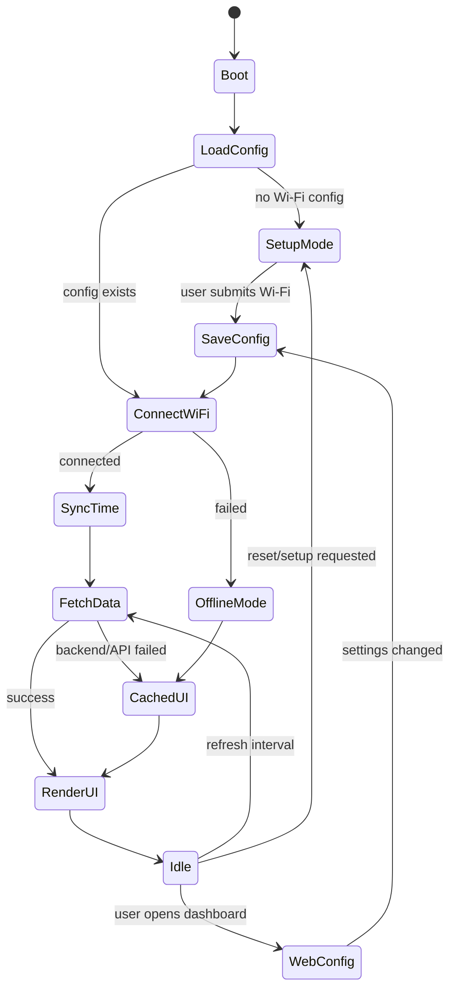
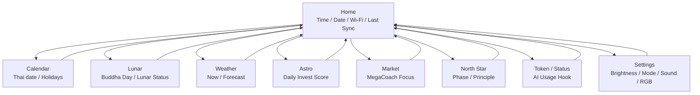
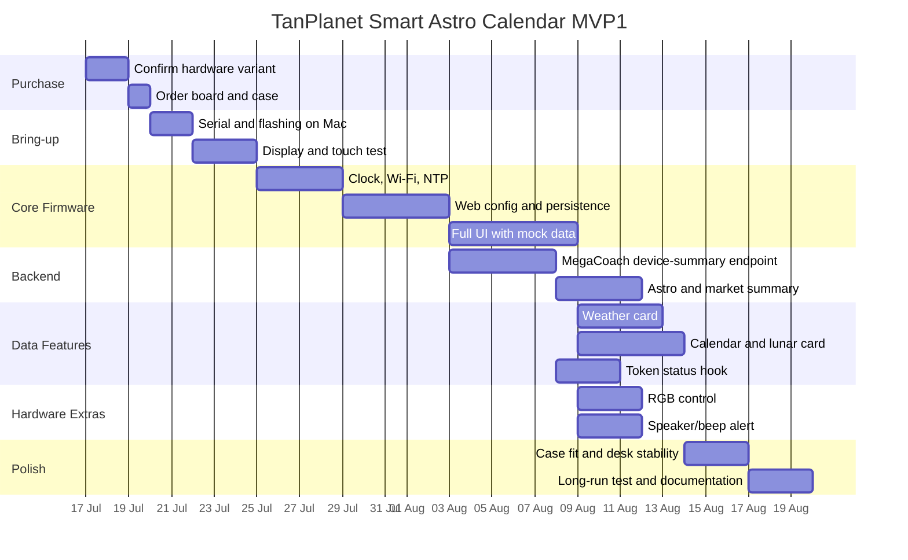

# Project Brief: TanPlanet Smart Astro Calendar

## 1. ภาพรวมโครงการ

TanPlanet Smart Astro Calendar คือโปรเจกต์สร้างอุปกรณ์จอแสดงผลอัจฉริยะตั้งโต๊ะบนบอร์ด ESP32 CYD ขนาด 3.5 นิ้ว พร้อมจอ TFT touch และเคส เพื่อแสดงข้อมูลที่ผสมระหว่างปฏิทินไทย เวลา สภาพอากาศ คอนเทนต์สายมู/โหราศาสตร์ และข้อมูลดิจิทัลส่วนตัว เช่น token usage หรือสถานะการใช้งานเครื่องมือ AI อย่าง Claude, Codex หรือบริการที่เกี่ยวข้อง

แนวคิดหลักคือทำอุปกรณ์ขนาดเล็กที่เปิดทิ้งไว้บนโต๊ะแล้วให้ข้อมูลที่ผู้ใช้สนใจทันทีโดยไม่ต้องเปิดมือถือหรือคอมพิวเตอร์ เป็นทั้งปฏิทินดิจิทัล นาฬิกา weather station และ personal signal dashboard สำหรับงานด้านดวง โชคชะตา และข้อมูลเชิง ritual/lifestyle

## 2. ที่มาและแรงบันดาลใจ

ผู้ใช้สนใจซื้อบอร์ด ESP32 Arduino LVGL/CYD ขนาด 3.5 นิ้วพร้อมเคสจาก Shopee และพบผลิตภัณฑ์แนว Smart WiFi Calendar ที่ใช้บอร์ดตระกูล ESP32 CYD เช่น ESP32-2432S028R แสดงปฏิทินไทย วันพระ สภาพอากาศ และเลขมงคล จึงต้องการทำเวอร์ชันของตัวเองที่ปรับให้เข้ากับโปรเจกต์ TanPlanet และความสนใจด้านดวง ชะตา เลขศาสตร์ และข้อมูลจากบริการดิจิทัล

ผลิตภัณฑ์ต้นแบบที่ศึกษาให้แนวทางสำคัญดังนี้:

- ใช้ ESP32 CYD เป็นอุปกรณ์หลัก
- แสดงปฏิทินและเวลาแบบ standalone
- เชื่อมต่อ Wi-Fi เพื่อซิงก์เวลาและดึงข้อมูลภายนอก
- มีจอ touch สำหรับควบคุมและตั้งค่า
- มี Web Interface สำหรับ config
- บันทึกค่าต่าง ๆ ไว้ในตัวเครื่องเพื่อไม่หายเมื่อไฟดับหรือ Wi-Fi หลุด
- ใช้ RGB/backlight และ auto dim เพื่อให้เหมาะกับการตั้งบนโต๊ะหรือหัวเตียง

## 3. เป้าหมายของโครงการ

- สร้างอุปกรณ์จออัจฉริยะตั้งโต๊ะที่ใช้งานได้จริงบน ESP32 CYD
- แสดงเวลา วันที่ ปฏิทินไทย ปฏิทินจันทรคติ วันพระ และวันหยุดสำคัญ
- แสดงข้อมูลสายมู เช่น เลขมงคล แนวโน้มประจำวัน/งวด หรือคอนเทนต์ดวงในรูปแบบที่อ่านง่าย
- ดึงข้อมูลสภาพอากาศและแสดงผลบนหน้าจอพร้อมไอคอน
- รองรับการแสดงข้อมูล token usage, cost หรือ quota จาก Claude/Codex/OpenAI หรือบริการที่เกี่ยวข้องในอนาคต
- ตั้งค่า Wi-Fi และค่าพื้นฐานผ่าน Web Interface ได้
- บันทึกสถานะล่าสุดไว้ในหน่วยความจำของบอร์ดเพื่อให้กลับมาทำงานต่อได้หลัง restart

## 4. กลุ่มผู้ใช้งานเป้าหมาย

- ผู้ใช้ที่สนใจดวง โหราศาสตร์ เลขศาสตร์ วันมงคล และปฏิทินไทย
- คนที่ต้องการ gadget ตั้งโต๊ะที่เป็นมากกว่านาฬิกาหรือปฏิทินธรรมดา
- นักพัฒนา maker ที่ต้องการต้นแบบ ESP32 CYD พร้อม UI จริง
- ผู้ใช้ AI tools ที่อยากเห็น token/cost/status แบบ glanceable บนโต๊ะทำงาน
- ทีม TanPlanet สำหรับทดลองผลิตภัณฑ์สาย spiritual tech หรือ lifestyle tech

## 5. Positioning

อุปกรณ์นี้ควรถูกวางตำแหน่งเป็น "Smart Astro Calendar" หรือ "Spiritual Tech Desk Display" ไม่ใช่แค่ Arduino demo board จุดต่างคือมีบุคลิกและ use case ชัดเจน: ปฏิทินไทย + สายมู + สภาพอากาศ + personal dashboard บนจอเล็กที่พร้อมตั้งใช้งานจริง

คอนเทนต์เลขมงคลหรือแนวโน้มโชคชะตาควรถูกสื่อสารเป็นคอนเทนต์เพื่อความบันเทิง ความเชื่อส่วนบุคคล และ lifestyle ไม่ควรสื่อสารเป็นการรับประกันผลลัพธ์ด้านหวย การเงิน หรือการตัดสินใจที่มีความเสี่ยง

## 6. ฟีเจอร์หลัก

### 6.1 Smart Calendar

- แสดงวัน เดือน ปี และเวลาแบบเรียลไทม์
- ซิงก์เวลาผ่าน NTP เช่น `th.pool.ntp.org`
- รองรับ timezone ประเทศไทย
- แสดงวันหยุดราชการไทยหรือวันสำคัญที่กำหนดเอง

### 6.2 Thai Lunar Calendar & Buddhist Holy Days

- แสดงข้างขึ้น ข้างแรม และวันพระ
- มีไอคอนดวงจันทร์หรือ visual cue สำหรับสถานะจันทรคติ
- ไฮไลต์วันที่สำคัญด้วยสีหรือแถบแจ้งเตือนบน UI

### 6.3 Astro & Lucky Signal

- แสดงเลขมงคลหรือแนวโน้มตัวเลขตามสูตรที่กำหนดเอง
- รองรับการคำนวณล่วงหน้าตามรอบวันที่ 1 และ 16 หากต้องการ
- สามารถเพิ่มสูตรที่อ้างอิงปฏิทินจันทรคติ ตำแหน่งดวงอาทิตย์ วันเกิด หรือข้อมูลเชิงโหราศาสตร์อื่นในอนาคต
- ควรมี disclaimer ว่าเป็นข้อมูลเชิงความเชื่อและความบันเทิง

### 6.4 Weather Station

- แสดงอุณหภูมิ ความชื้น และพยากรณ์อากาศ
- รองรับการดึงข้อมูลจาก weather API ผ่าน Wi-Fi
- แสดง forecast ระยะสั้น เช่น วันนี้และล่วงหน้า 3-4 วัน
- ใช้ไอคอนสภาพอากาศที่อ่านง่ายบนจอขนาดเล็ก

### 6.5 AI Token & Digital Status Panel

- แสดง token usage, quota, cost estimate หรือสถานะการใช้งาน AI tools เช่น Claude, Codex, OpenAI API หรือบริการที่กำหนด
- รองรับการดึงข้อมูลจาก local bridge หรือ backend ส่วนตัว แทนการเก็บ API key สำคัญไว้บน ESP32 โดยตรง
- แสดงข้อมูลแบบสรุป เช่น token วันนี้, cost วันนี้, quota คงเหลือ, last sync และสถานะ error
- ฟีเจอร์นี้อาจเป็น Phase 2 เพราะต้องออกแบบความปลอดภัยของ credentials และแหล่งข้อมูลให้ชัดเจน

### 6.6 Web Interface สำหรับตั้งค่า

- ตั้งค่า Wi-Fi ครั้งแรกผ่าน captive portal หรือ WiFiManager
- ตั้งค่า location สำหรับ weather
- ตั้งค่าความสว่างหน้าจอ
- เปิด/ปิด RGB LED หรือเลือก effect
- ตั้งค่า mode ที่จะแสดงบนหน้าจอ เช่น Calendar, Astro, Weather, Token

### 6.7 Persistent Storage

- บันทึกค่าตั้งต้นและสถานะล่าสุดลง SPIFFS, LittleFS หรือ Preferences/NVS
- อุปกรณ์ควรกลับมาทำงานต่อได้หลังไฟดับหรือ restart
- หาก Wi-Fi ใช้งานไม่ได้ ควรยังแสดงเวลาล่าสุดหรือข้อมูล cached ที่มีอยู่ พร้อมแจ้งสถานะ offline

### 6.8 Auto Dim & Desk Mode

- ปรับความสว่างหน้าจออัตโนมัติตามช่วงเวลา
- รองรับ daytime/night mode
- ลดแสงช่วงกลางคืนเพื่อไม่รบกวนสายตา
- ถ้ามี RGB LED ควรมีโหมด static, blink หรือ ambient effect แบบไม่รบกวน

## 7. ขอบเขตงาน

### อยู่ในขอบเขต MVP

- ใช้ ESP32 CYD smart display ขนาด 3.5 นิ้วเป็น hardware หลัก
- แสดงเวลา วันที่ และสถานะ Wi-Fi บนจอ
- ซิงก์เวลาด้วย NTP
- ทำ UI พื้นฐานด้วย LVGL หรือ library ที่เหมาะกับบอร์ดจริง
- แสดงปฏิทินไทย วันพระ หรือข้อมูลจันทรคติชุดแรก
- แสดง weather จาก API อย่างน้อย 1 แหล่ง
- มี Web Interface สำหรับตั้งค่า Wi-Fi และค่าพื้นฐาน
- บันทึก config ลง storage บนบอร์ด
- ใส่เคสและทดสอบการใช้งานแบบตั้งโต๊ะ

### อยู่ในขอบเขต Phase 2

- ระบบเลขมงคลหรือ astro algorithm ที่ซับซ้อนขึ้น
- หน้า token/Claude/Codex/OpenAI usage
- Backend/local bridge สำหรับดึงข้อมูลที่ ESP32 ไม่ควรเข้าถึงตรง
- UI หลายหน้าและ touch navigation ที่สมบูรณ์
- RGB LED effects และ theme customization
- export หรือ sync log ไปยังระบบภายนอก

### อยู่นอกขอบเขตระยะแรก

- Mobile app native สำหรับ iOS/Android
- Cloud service production-scale
- ระบบ account หลายผู้ใช้
- การรับประกันผลลัพธ์ด้านโชค การเงิน หรือเลขรางวัล
- การเก็บ API key สำคัญแบบ plain text บนตัว ESP32

## 8. Hardware Candidate

- บอร์ดหลัก: ESP32 CYD smart display ขนาด 3.5 นิ้ว
- หน้าจอ: TFT touch ขนาด 3.5 นิ้วเป็นตัวเลือกหลัก เพราะมีพื้นที่แสดงผลมากกว่า 2.8" เหมาะกับ Calendar, Weather, Astro และ Token panel
- รุ่น 2.8" เช่น ESP32-2432S028R ใช้เป็น reference ได้ แต่ไม่ใช่ target hardware หลักของโปรเจกต์นี้
- การเชื่อมต่อ: Wi-Fi 2.4GHz, Bluetooth ตามความสามารถของบอร์ด
- จ่ายไฟ: USB 5V แนะนำอย่างน้อย 1A
- เคส: เคสสำหรับ ESP32 Arduino LVGL/CYD ที่ตรงกับขนาดจอและตำแหน่งพอร์ต
- อุปกรณ์เสริมที่อาจใช้: RGB LED, sensor แสง, sensor อุณหภูมิ/ความชื้นภายนอก, speaker หรือ buzzer

จุดที่ต้องยืนยันก่อนซื้อ — **ยืนยันครบแล้ว (2026-07-17): รุ่น ESP32-035 จาก modulemore ฿640**:

- ✅ จอ 3.5" ความละเอียด 320x480, display driver **ST7796**
- ✅ touch driver **XPT2046 resistive** (แถม stylus)
- ✅ pinout เต็มจาก github.com/littleCdev/ESP32-035 → อยู่ใน `firmware/include/hardware_profiles.h`
- ✅ มี audio amp LTK8002D + ช่องลำโพง, LDR light sensor, RGB LED, Micro SD ครบในบอร์ด
- ⚠️ **ไม่มีเคส** — บอร์ดเปลือย มีรูน็อต 3.2mm ต้องหาเคสหรือ 3D print เอง
- ⚠️ USB-C บนบอร์ดต้องใช้สาย/อะแดปเตอร์ USB-C to USB-A เท่านั้น (ไม่มี CC resistors)

## 9. Software Architecture

```text
ESP32 CYD Smart Display
  |
  | Wi-Fi
  v
NTP / Weather API / Backend Bridge
  |
  | Parsed Data + Cached State
  v
Application State on ESP32
  |
  | LVGL / Display Driver / Touch Driver
  v
Smart Astro Calendar UI
```

สำหรับข้อมูล token หรือข้อมูลจาก AI services ควรใช้ local bridge/backend ช่วยดึงข้อมูล:

```text
Claude / Codex / OpenAI / Usage Source
  |
  | Secure API Access
  v
Local Bridge or Private Backend
  |
  | Sanitized Summary API
  v
ESP32 Smart Display
```

เหตุผลคือ ESP32 มีข้อจำกัดด้าน security, memory และ certificate handling จึงไม่ควรเก็บ secret key สำคัญบนตัวอุปกรณ์ถ้าไม่จำเป็น

## 10. Data Sources

- เวลา: NTP server เช่น `th.pool.ntp.org`
- สภาพอากาศ: weather API ที่รองรับ location ประเทศไทย
- วันหยุดไทย: static JSON ฝังใน firmware หรือดึงจาก backend
- วันพระ/จันทรคติ: algorithm ภายใน firmware หรือ precomputed calendar data
- เลขมงคล/astro signal: algorithm ของโปรเจกต์ TanPlanet หรือ data feed ที่ควบคุมเอง
- Token/cost/status: local bridge, backend ส่วนตัว หรือ export file จาก workflow ที่ใช้งานจริง

## 11. UX Direction

UI ต้องเหมาะกับจอ 3.5 นิ้วที่ยังมีพื้นที่จำกัดเมื่อเทียบกับมือถือ แต่มีพื้นที่พอสำหรับ dashboard หลายข้อมูลมากกว่ารุ่น 2.8":

- ใช้ตัวเลขเวลาและวันที่ขนาดใหญ่
- แยกหน้าเป็น mode ชัดเจน เช่น Calendar, Astro, Weather, Token, Settings
- ใช้สีเพื่อบอกสถานะ เช่น online/offline, วันพระ, warning, sync error
- หลีกเลี่ยงข้อความยาวเกินจอ
- touch target ต้องใหญ่พอสำหรับจอ resistive touch
- มีสถานะ last sync เพื่อให้ผู้ใช้รู้ว่าข้อมูลล่าสุดเมื่อไร

## 12. ความต้องการเชิงเทคนิค

### Firmware

- Arduino IDE, PlatformIO หรือ ESP-IDF ตามความเหมาะสม
- LVGL สำหรับ UI หากบอร์ดและ memory รองรับได้ดี
- TFT_eSPI หรือ display library ที่ตรงกับ driver จริง
- WiFiManager หรือ captive portal สำหรับตั้งค่า Wi-Fi
- HTTP client สำหรับเรียก API
- JSON parser เช่น ArduinoJson
- Preferences/NVS, SPIFFS หรือ LittleFS สำหรับ persistent config

### Web Interface

- หน้า config แบบ lightweight ที่รันจาก ESP32
- ตั้งค่า location, brightness, RGB mode และ display mode
- แสดงสถานะ Wi-Fi, firmware version และ last sync
- ควรมี endpoint สำหรับ debug เช่น `/status` และ `/config`

### Security

- ไม่ควรฝัง API key สำคัญไว้ใน firmware ที่แจกหรือ flash ให้หลายเครื่อง
- หากต้องใช้ token usage จากบริการ AI ควรให้ backend ส่งเฉพาะ summary ที่ปลอดภัย
- Web Interface ควรมีรหัสผ่านหรืออย่างน้อยจำกัดการใช้งานเฉพาะ local network

## 13. ตัวชี้วัดความสำเร็จ

- เปิดเครื่องแล้วเชื่อม Wi-Fi และซิงก์เวลาได้เอง
- หน้าจอแสดงเวลา วันที่ ปฏิทินไทย และสถานะสำคัญได้ชัดเจน
- ข้อมูล weather sync สำเร็จและมี fallback เมื่อ network ล่ม
- ข้อมูลวันพระ/จันทรคติแสดงถูกต้องตามวันที่ไทย
- UI touch ใช้งานได้จริงบนจอขนาดเล็ก
- config ไม่หายหลัง restart หรือไฟดับ
- เคสใช้งานได้จริง ไม่บังพอร์ตสำคัญ และตั้งโต๊ะได้มั่นคง
- Phase 2 สามารถเพิ่ม token/AI status ได้โดยไม่ต้องรื้อ architecture ใหม่

## 14. Milestone เบื้องต้น

| ระยะ | รายการงาน | ผลลัพธ์ |
| --- | --- | --- |
| Phase 0 | เลือกบอร์ด ขนาดจอ และเคส | Hardware direction ชัดเจน |
| Phase 1 | Bring-up display, touch, Wi-Fi และ NTP | อุปกรณ์เปิดติด แสดงเวลา และรับ touch ได้ |
| Phase 2 | สร้าง UI Calendar + Settings | ใช้งานเป็นปฏิทินตั้งโต๊ะพื้นฐานได้ |
| Phase 3 | เพิ่มจันทรคติ วันพระ และวันหยุดไทย | เริ่มมีเอกลักษณ์สายไทย/สายมู |
| Phase 4 | เพิ่ม Weather API และ cache | เป็น smart calendar ที่ใช้ได้จริงทุกวัน |
| Phase 5 | เพิ่ม Astro/Lucky Signal | มีฟีเจอร์ดวง/เลขมงคลตามสูตรของโปรเจกต์ |
| Phase 6 | เพิ่ม Web Interface และ persistent config | ตั้งค่าได้ง่ายและข้อมูลไม่หาย |
| Phase 7 | เพิ่ม Token/AI Status Panel | เชื่อมกับ workflow Claude/Codex/OpenAI |
| Phase 8 | Polish UI, case test และทำคู่มือ | พร้อม demo หรือทดลองใช้งานจริง |

## 15. ความเสี่ยงและข้อควรระวัง

- บอร์ด CYD แต่ละ variant ใช้ driver และ pinout ต่างกัน ทำให้ code ใช้ข้ามรุ่นไม่ได้ทันที
- จอ resistive touch อาจใช้นิ้วไม่ลื่นเหมือนจอมือถือ ต้องออกแบบปุ่มใหญ่และเรียบง่าย
- LVGL อาจกิน memory มาก ต้องควบคุมจำนวนหน้าจอ รูปภาพ และ animation
- Weather API และข้อมูลภายนอกอาจมี rate limit หรือเปลี่ยน format
- การคำนวณวันพระ/จันทรคติต้องตรวจความถูกต้องกับแหล่งอ้างอิง
- ฟีเจอร์เลขมงคลควรระวังข้อความโฆษณาไม่ให้สื่อว่าเป็นการรับประกันผลลัพธ์
- Token/AI usage อาจเกี่ยวข้องกับข้อมูลส่วนตัวหรือ API key จึงควรออกแบบผ่าน backend bridge
- เคสอาจบังปุ่ม reset/boot, pin header หรือช่อง USB ต้องตรวจจากรูปและรีวิวก่อนซื้อ
- รุ่น 3.5" อาจมีตัวอย่างโค้ดน้อยกว่ารุ่น 2.8" และอาจใช้ driver/pinout คนละชุด ต้องให้ร้านยืนยัน library config ก่อนซื้อ

## 16. คำถามที่ควรยืนยันต่อ

- โปรเจกต์นี้ควรใช้ชื่ออะไร: TanPlanet Smart Astro Calendar, Live Astro Display หรือชื่ออื่น
- ยืนยันรุ่น 3.5" ที่จะซื้อให้ชัดเจน: model, resolution, display driver, touch driver และ pinout คืออะไร
- ฟีเจอร์ token หมายถึง token usage/cost ของ Claude, Codex, OpenAI หรือข้อมูล blockchain token
- ต้องการให้คอนเทนต์ดวง/เลขมงคลคำนวณในเครื่อง หรือดึงจาก backend ของ TanPlanet
- ต้องการใช้ weather API เจ้าใด และ location หลักคือจังหวัด/เมืองอะไร
- ต้องการให้จอมีภาษาไทยเต็มรูปแบบหรือใช้ไทยผสมอังกฤษ
- จะใช้เป็นของส่วนตัว demo หรือมีเป้าหมายทำเป็นสินค้าในอนาคต

## 17. Deliverables

- Firmware สำหรับ ESP32 CYD smart display
- LVGL/UI screens สำหรับ Calendar, Astro, Weather, Settings และ Token ใน Phase 2
- Web Interface สำหรับตั้งค่าและตรวจสถานะเครื่อง
- Data model สำหรับ calendar, weather, astro signal และ token summary
- คู่มือการ flash firmware และตั้งค่า Wi-Fi ครั้งแรก
- Checklist ตรวจ hardware, pinout, driver, touch และเคส
- Demo script สำหรับนำเสนอโปรเจกต์

## 18. อธิบายคอนเซ็ปต์แบบเริ่มจากศูนย์

โปรเจกต์นี้แบ่งเป็น 3 ชั้นหลัก:

- Device: บอร์ด ESP32 CYD พร้อมจอ touch ทำหน้าที่เปิดเครื่อง ต่อ Wi-Fi แสดงผล และรับการกดจากผู้ใช้
- Data Feed: แหล่งข้อมูลที่เครื่องดึงมาแสดง เช่น เวลา NTP, weather API, ปฏิทินไทย, วันพระ, token usage หรือสรุปจาก MegaCoach
- Knowledge/Brain: ระบบที่คิดหรือสรุปข้อมูลให้แล้ว เช่น MegaCoach, Thai Astrology API, backend ส่วนตัว หรือไฟล์ JSON ที่เตรียมไว้

วิธีคิดที่ถูกต้องคือไม่ให้ ESP32 เป็นสมองทั้งหมด แต่ให้ ESP32 เป็น "หน้าจออัจฉริยะ" ที่ดึงข้อมูลสรุปสั้น ๆ มาแสดง ส่วนงานที่หนักกว่า เช่น AI summary, โหราศาสตร์ละเอียด, token usage, portfolio signal หรือการเก็บ API key ควรอยู่บน backend หรือระบบเดิมอย่าง MegaCoach

ระดับความยากโดยประมาณ:

- ง่าย: เปิดจอ แสดงข้อความ เวลา วันที่ และรูปแบบ UI พื้นฐาน
- ปานกลาง: ต่อ Wi-Fi, sync เวลา, ดึง weather API, เก็บ config
- ค่อนข้างยาก: ทำ touch UI หลายหน้า, LVGL, auto dim, persistent storage
- ยาก: ดึงข้อมูลจาก MegaCoach/AI/token อย่างปลอดภัย และทำให้ระบบเสถียรระยะยาว

สำหรับมือใหม่ควรเริ่มจาก MVP เล็กมาก: เปิดจอให้ติด แสดงเวลาไทยให้ถูก ต่อ Wi-Fi ได้ แล้วค่อยเพิ่มฟีเจอร์ทีละชั้น

## 19. แนวทางใช้ Knowledge จาก MegaCoach

จากโปรเจกต์ `/Users/natpakansirirat/Documents/Projects/tanplanet/megacoach` มีฐานงานที่เอามาต่อยอดได้ดี:

- `README.md`: MegaCoach เป็นโค้ชหุ้นส่วนตัวสำหรับคัดหุ้น วิเคราะห์ บริหารพอร์ต และมี disclaimer ด้านการลงทุน
- `coach-playbook.md`: มี playbook วิเคราะห์หุ้น 7 ท่า เช่น deep dive, screener, earnings decoder, risk assessment, portfolio builder และ entry timing
- `thai-astrology/README.md`: มี Thai Astrology API สำหรับผูกดวง ทักษา และฤกษ์ โดยใช้ Swiss Ephemeris
- `liff-app/api/astro-summary.js`: มีแนวทางสรุป "ดวงลงทุนวันนี้" เป็นภาษาไทยแบบสั้น และวาง guardrail ว่าเป็นความบันเทิง ไม่ใช่คำแนะนำลงทุน
- `liff-app/api/coach.js`: มี MegaCoach API ที่ใช้ข้อมูลพอร์ต/strategy เป็น context
- `liff-app/entry-signal-data.json`, `liff-app/northstar.json`, `liff-app/idea-radar.json`, `liff-app/monthly-plan.json`: เป็นข้อมูลสรุปที่สามารถแปลงเป็น feed สำหรับจอเล็กได้

แนวทางที่เหมาะสมคือสร้าง endpoint ใหม่ใน MegaCoach เช่น `/api/device-summary` เพื่อส่งข้อมูลสรุปที่ปลอดภัยและสั้นพอสำหรับ ESP32:

```json
{
  "updatedAt": "2026-07-17T08:00:00+07:00",
  "cards": [
    {"mode":"astro","title":"ดวงลงทุนวันนี้","value":"ตั้งสติ เดินตามแผน","tone":"neutral"},
    {"mode":"market","title":"Idea Radar","value":"รอสัญญาณ ไม่ไล่ราคา","tone":"caution"},
    {"mode":"token","title":"AI Usage","value":"พร้อมใช้งาน","tone":"ok"}
  ]
}
```

ESP32 ควรดึง endpoint นี้แทนการเรียก OpenAI, Claude, Codex หรือข้อมูลพอร์ตลึกโดยตรง เพราะจะลดความเสี่ยงเรื่อง secret key, memory และข้อมูลส่วนตัว

## 20. Hardware ที่ควรซื้อ

รายการเริ่มต้นที่แนะนำ:

- ESP32 CYD smart display ขนาด 3.5" รุ่นที่ร้านระบุ model, resolution, display driver, touch driver, pinout และ example code ชัดเจน
- เคสที่ตรงกับบอร์ดและขนาดจอเดียวกัน
- สาย USB หรือ USB-C สำหรับจ่ายไฟและ flash firmware
- Adapter 5V 1A หรือมากกว่า
- Stylus หากจอเป็น resistive touch

รายการเสริมที่ยังไม่ต้องรีบซื้อ:

- Light sensor เช่น BH1750 ถ้าต้องการ auto dim จากแสงจริง แทนการใช้เวลาช่วงกลางวัน/กลางคืน
- Temperature/humidity sensor เช่น SHT31, DHT22 หรือ BME280 ถ้าต้องการวัดอากาศจริงในห้อง
- MicroSD card ถ้าต้องเก็บ asset หรือ log มากขึ้น
- Speaker/buzzer ถ้าต้องการแจ้งเตือน
- RGB LED เพิ่มเติม เฉพาะกรณีบอร์ดที่ซื้อไม่มีไฟ RGB หรืออยากทำ ambient light ภายนอกเคส

สิ่งที่ยังไม่ควรซื้อในช่วงแรก:

- Relay, motor, actuator หรืออุปกรณ์ไฟแรง เพราะยังไม่จำเป็นกับ MVP และเพิ่มความเสี่ยง
- Sensor หลายชนิดพร้อมกัน เพราะจะทำให้ debug ยากก่อนที่จอและ Wi-Fi จะนิ่ง
- บอร์ดหลายขนาดพร้อมกัน เพราะแต่ละขนาดอาจใช้ driver/pinout ต่างกัน

## 21. ข้อมูลที่ต้องเตรียม

ข้อมูลส่วนตัว/โหราศาสตร์:

- วัน เดือน ปีเกิด
- เวลาเกิด หากต้องการผูกดวงละเอียด
- จังหวัดหรือพิกัดเกิด
- รูปแบบคอนเทนต์ที่ต้องการ เช่น ดวงรายวัน ฤกษ์ เลขมงคล หรือ mood signal

ข้อมูลปฏิทิน:

- รายการวันหยุดไทย
- รายการวันพระหรือวิธีคำนวณวันพระ
- วันสำคัญของ TanPlanet หรือ event ที่อยากให้จอเตือน

ข้อมูลสภาพอากาศ:

- จังหวัด/เมืองหลักที่จะแสดง
- API provider ที่จะใช้
- หน่วยอุณหภูมิและ forecast กี่วัน

ข้อมูล MegaCoach/AI:

- ต้องการแสดงข้อมูลอะไรบนจอเล็ก เช่น ดวงลงทุนวันนี้, market mood, watchlist signal, North Star progress, token usage
- ต้องสร้าง summary endpoint ที่ตัดข้อมูลละเอียดและข้อมูลส่วนตัวออก
- API key ของ OpenAI/Claude/Codex ต้องอยู่ใน backend หรือ environment variable ไม่ควรฝังใน firmware

## 22. แผนเริ่มต้นที่เหมาะกับมือใหม่

| ช่วง | เป้าหมาย | สิ่งที่ควรได้ |
| --- | --- | --- |
| Step 0 | ซื้อบอร์ด/เคสให้ถูก variant | รู้รุ่นจอ driver touch และ pinout |
| Step 1 | Flash ตัวอย่างจากร้านหรือ community | จอเปิดติด touch ใช้ได้ |
| Step 2 | ทำหน้า Hello/Clock | แสดงเวลาและวันที่บนจอได้ |
| Step 3 | ต่อ Wi-Fi + NTP | เวลาไทยถูกต้องหลังเปิดเครื่อง |
| Step 4 | เพิ่ม Web Config | ตั้งค่า Wi-Fi/location/brightness ได้ |
| Step 5 | เพิ่ม Weather | ดึงข้อมูลภายนอกสำเร็จและมี cache |
| Step 6 | เพิ่ม Calendar/Astro | วันพระ/จันทรคติ/ดวงรายวันเริ่มแสดงได้ |
| Step 7 | เชื่อม MegaCoach summary | จอดึง knowledge เดิมมาแสดงแบบสั้น |
| Step 8 | Polish UI + ใส่เคส | พร้อมวางใช้งานจริงบนโต๊ะ |

คำแนะนำสำคัญ: อย่าเริ่มจาก LVGL หลายหน้า + weather + astrology + MegaCoach พร้อมกัน ให้เริ่มจากจอและ Wi-Fi ก่อน เพราะ hardware bring-up คือจุดที่มือใหม่มักติดมากที่สุด

## 23. Work Breakdown แบบละเอียด

### Workstream A: Pre-purchase & Hardware Validation

เป้าหมาย: ซื้อ hardware ให้ถูก variant และลดความเสี่ยงเรื่อง driver/pinout ก่อนเริ่มเขียนโค้ด

งานที่ต้องทำ:

- ส่งคำถามร้านเพื่อยืนยัน model, resolution, display driver, touch driver, pinout, case fit และ speaker output
- เลือก variant 3.5" ให้ชัดเจน เช่น `ESP32-3248S035R` หรือ `ESP32-3248S035C`
- ขอ example code หรือ link library config ของรุ่น 3.5" จากร้าน
- ยืนยันว่าเคสตรงกับบอร์ดจริง ไม่บัง USB, BOOT/RESET, SD card หรือ speaker connector
- เตรียมสาย USB data และ adapter 5V 1A+

Output:

- รายการ hardware ที่จะซื้อ
- Screenshot/ข้อความยืนยันจากร้าน
- Pinout/example code ของบอร์ดรุ่นจริง

Done criteria:

- รู้ว่าเป็น resistive หรือ capacitive touch
- รู้ display driver และ resolution
- มี sample code ที่เปิดจอ/touch ได้จริงสำหรับรุ่นนั้น

ความยาก: ต่ำถึงกลาง แต่สำคัญมาก เพราะถ้าซื้อผิดจะทำให้ทุกขั้นหลังจากนี้ยากขึ้นทันที

### Workstream B: Development Environment บน Mac

เป้าหมาย: ทำให้ MacBook Pro M4 Pro พร้อม compile และ flash ESP32

งานที่ต้องทำ:

- ติดตั้ง Arduino IDE หรือ VS Code + PlatformIO
- ติดตั้ง ESP32 board support
- ตรวจว่า macOS เห็น serial port ด้วย `ls /dev/cu.*`
- ถ้าบอร์ดใช้ CP210x หรือ CH340/CH341 แล้วไม่เจอ port ให้ลง driver ตามชิปจริง
- ทดสอบ upload sketch ง่าย ๆ เช่น blink หรือ serial print

Output:

- เครื่อง Mac flash firmware เข้า ESP32 ได้
- เปิด serial monitor อ่าน log ได้

Done criteria:

- กด upload สำเร็จอย่างน้อย 1 sketch
- Serial monitor แสดงข้อความ boot/log ได้
- รู้ชื่อ port ที่ใช้ เช่น `/dev/cu.usbserial...`

ความยาก: ต่ำ ถ้าสาย USB เป็นสาย data และ driver ตรง

### Workstream C: Display & Touch Bring-up

เป้าหมาย: เปิดจอ 3.5" และรับ touch ให้ได้ก่อนทำ feature อื่น

งานที่ต้องทำ:

- รัน example code จากร้านหรือ community
- ยืนยันว่า screen orientation ถูกต้อง
- ทดสอบ backlight brightness
- ทดสอบ touch calibration
- ถ้าเป็น resistive touch ให้ทำ calibration และบันทึกค่า
- ถ้าเป็น capacitive touch ให้ทดสอบตำแหน่งแตะหลายจุด
- สร้างหน้า test ง่าย ๆ เช่น ปุ่ม 4 มุม กดแล้วเปลี่ยนสี

Output:

- Firmware test สำหรับ display/touch
- ค่า config ของ display driver, touch driver และ pin mapping

Done criteria:

- จอแสดงผลเต็มพื้นที่ 320x480 หรือ resolution จริงของรุ่น
- touch กดตรงตำแหน่ง ไม่กลับแกน ไม่สลับซ้ายขวา
- backlight ปรับได้หรืออย่างน้อยเปิดติดคงที่

ความยาก: กลาง และเป็นจุดเสี่ยงที่สุดของโปรเจกต์มือใหม่

### Workstream D: MVP Clock + Wi-Fi + NTP

เป้าหมาย: ทำให้เครื่องกลายเป็น smart clock พื้นฐานก่อน

งานที่ต้องทำ:

- ต่อ Wi-Fi ด้วย SSID/password hardcoded ชั่วคราวในช่วงทดสอบ
- sync เวลาผ่าน NTP เช่น `th.pool.ntp.org`
- ตั้ง timezone ประเทศไทย `UTC+7`
- แสดงเวลา วันที่ และสถานะ Wi-Fi บนจอ
- แสดง last sync time
- ทำ fallback ถ้า Wi-Fi หลุด เช่น แสดงสถานะ offline

Output:

- หน้า Clock ที่ใช้งานจริงบนจอ
- ระบบ sync เวลาอัตโนมัติหลังเปิดเครื่อง

Done criteria:

- เปิดเครื่องแล้วเวลาถูกต้องภายใน 30-60 วินาทีหลัง Wi-Fi ต่อสำเร็จ
- ถ้า Wi-Fi ไม่ติด ผู้ใช้เห็นสถานะชัดเจน
- หน้าจออ่านได้จากระยะวางบนโต๊ะ

ความยาก: ต่ำถึงกลาง

### Workstream E: Web Config & Persistent Storage

เป้าหมาย: ตั้งค่าเครื่องโดยไม่ต้องแก้โค้ดทุกครั้ง

งานที่ต้องทำ:

- เพิ่ม Web Interface แบบ local network
- ตั้งค่า Wi-Fi ผ่าน WiFiManager หรือ captive portal
- เพิ่มหน้า config สำหรับ location, brightness, display mode และ refresh interval
- บันทึก config ลง Preferences/NVS หรือ LittleFS
- เพิ่ม endpoint debug เช่น `/status` และ `/config`

Output:

- หน้า web config เบื้องต้น
- config อยู่รอดหลัง restart

Done criteria:

- เปลี่ยน location/brightness แล้ว restart ไม่หาย
- เข้า web config จากมือถือหรือ Mac ในวง Wi-Fi เดียวกันได้
- มีปุ่ม reset config หรือวิธีเข้า setup mode เมื่อ Wi-Fi เปลี่ยน

ความยาก: กลาง

### Workstream F: Weather Panel

เป้าหมาย: เพิ่ม utility รายวันที่ใช้ได้จริง

งานที่ต้องทำ:

- เลือก weather API ที่เหมาะกับประเทศไทย
- กำหนด location หลัก
- ดึงอุณหภูมิ สภาพอากาศ ความชื้น และ forecast สั้น ๆ
- cache ข้อมูลล่าสุดไว้ใน storage หรือ RAM
- แสดง error/fallback เมื่อ API ใช้ไม่ได้
- ออกแบบ icon/weather state ให้เหมาะกับจอเล็ก

Output:

- หน้า Weather หรือ weather card
- Data parser สำหรับ API ที่เลือก

Done criteria:

- แสดงอากาศปัจจุบันและ forecast ได้
- ถ้า network/API ล่ม ยังแสดงข้อมูลล่าสุดพร้อม last sync
- ไม่ refresh ถี่จนเกิน rate limit

ความยาก: กลาง

### Workstream G: Calendar, Thai Lunar & Buddhist Holy Days

เป้าหมาย: ทำให้เครื่องมีเอกลักษณ์เป็นปฏิทินไทย ไม่ใช่แค่นาฬิกา

งานที่ต้องทำ:

- แสดงวันที่ไทยและ พ.ศ.
- เตรียมข้อมูลวันหยุดไทย
- เลือกวิธีจัดการวันพระ: precomputed JSON หรือ algorithm
- แสดงข้างขึ้น/ข้างแรมหรือสถานะจันทรคติแบบย่อ
- ทำ highlight วันพระ/วันหยุดบน UI

Output:

- Calendar card สำหรับวันปัจจุบัน
- Data file หรือ function สำหรับวันพระ/วันหยุด

Done criteria:

- วันที่ไทยและ พ.ศ. ถูกต้อง
- วันพระ/วันหยุดแสดงได้ถูกต้องสำหรับช่วงทดสอบ
- ข้อความไม่ยาวจนล้นจอ

ความยาก: กลาง เพราะต้องตรวจความถูกต้องของข้อมูลปฏิทิน

### Workstream H: MegaCoach Device Summary Backend

เป้าหมาย: ให้ ESP32 ดึง knowledge จาก MegaCoach แบบปลอดภัยและเบา

งานที่ต้องทำใน `megacoach`:

- สร้าง endpoint ใหม่ เช่น `/api/device-summary`
- อ่านข้อมูลจาก `entry-signal-data.json`, `idea-radar.json`, `monthly-plan.json`, `northstar.json` และ astrology API
- สรุปให้เหลือข้อมูลสั้นมากสำหรับจอ 3.5"
- ไม่ส่งข้อมูล sensitive เช่น จำนวนเงินละเอียด, API key, private portfolio, encrypted data หรือ raw prompt
- ใส่ timestamp และ tone สำหรับ UI เช่น `ok`, `neutral`, `caution`, `danger`
- เพิ่ม fallback ถ้าบาง data source หาย

ตัวอย่าง response ที่เหมาะกับ ESP32:

```json
{
  "updatedAt": "2026-07-17T08:00:00+07:00",
  "cards": [
    {
      "id": "astro_today",
      "title": "ดวงลงทุนวันนี้",
      "value": "ปานกลาง",
      "detail": "ทำตามแผน ไม่ต้องเร่ง",
      "tone": "neutral"
    },
    {
      "id": "market_focus",
      "title": "Market Focus",
      "value": "VST / NVDA",
      "detail": "รอสัญญาณ ไม่ไล่ราคา",
      "tone": "caution"
    },
    {
      "id": "northstar",
      "title": "North Star",
      "value": "Phase 1",
      "detail": "Growth mode · Fear of Ruin > FOMO",
      "tone": "ok"
    }
  ]
}
```

งานที่ต้องทำใน ESP32:

- เรียก `/api/device-summary` ผ่าน HTTPS หรือ HTTP ใน local network
- parse JSON ด้วย ArduinoJson
- cache response ล่าสุด
- แสดง cards บน UI
- แสดง last sync และ error state

Output:

- MegaCoach feed ที่ ESP32 อ่านได้
- หน้า Dashboard บนจอที่แสดง knowledge เดิมของแทนแบบ glanceable

Done criteria:

- ESP32 ไม่ต้องรู้ API key ของ OpenAI/Claude/Codex
- response เล็กพอสำหรับ memory ของ ESP32
- ถ้า backend ล่ม จอยังแสดง cache ล่าสุดได้

ความยาก: กลางถึงสูง แต่เป็นส่วนที่ทำให้โปรเจกต์มีคุณค่าจริง

### Workstream I: Astro & Lucky Signal

เป้าหมาย: ดึงโหราศาสตร์ไทยจาก engine เดิมมาเป็น signal สั้น ๆ บนจอ

งานที่ต้องทำ:

- ใช้ endpoint ที่มีอยู่แล้ว เช่น `/daily-invest` เป็นฐาน
- ตัดข้อมูลให้เหลือ score, verdict, advice, moon rasi และเหตุผล 1-2 ข้อ
- อาจให้ MegaCoach backend เรียก `/api/astro-summary` เพื่อสร้างข้อความสั้น แล้วส่งต่อให้ ESP32
- เพิ่ม disclaimer สั้น ๆ ใน UI หรือคู่มือว่าเป็นความบันเทิง/ความเชื่อส่วนบุคคล
- หลีกเลี่ยงข้อความที่ดูเหมือนแนะนำซื้อขายจริง

Output:

- Astro card บนจอ
- Daily lucky/astro signal ที่เปลี่ยนตามวัน

Done criteria:

- จอแสดง score/คำแนะนำได้ใน 1 card
- ข้อความสั้น อ่านจบในไม่กี่วินาที
- ไม่ใช้ raw astrology payload ขนาดใหญ่บน ESP32

ความยาก: กลาง เพราะ engine มีอยู่แล้ว งานหลักคือสรุปและออกแบบ UI

### Workstream J: AI Token / Claude / Codex Status

เป้าหมาย: แสดงสถานะการใช้ AI tools โดยไม่ทำให้ security เสี่ยง

งานที่ต้องทำ:

- ยืนยันความหมายของ "token" ว่าหมายถึง usage/cost/quota ของ Claude, Codex, OpenAI หรืออย่างอื่น
- หาแหล่งข้อมูลที่ดึงได้จริง เช่น log/export/local script/API
- ให้ backend สรุปเป็น `todayTokens`, `todayCost`, `quotaStatus`, `lastSync`
- ESP32 แสดงเฉพาะ summary
- ไม่เก็บ secret key หรือ personal access token บน firmware

Output:

- Token status card
- Backend summary ที่ปลอดภัย

Done criteria:

- แสดงสถานะได้โดยไม่ expose key
- ถ้าดึงข้อมูลไม่ได้ จอแสดง `not available` แทน error ยาว ๆ

ความยาก: สูง เพราะขึ้นกับแหล่งข้อมูล token จริงและข้อจำกัดของแต่ละบริการ

### Workstream K: UI/UX บนจอ 3.5"

เป้าหมาย: ทำให้ข้อมูลเยอะอ่านง่ายบนจอเล็ก

หน้าที่ควรมี:

- Home: เวลาใหญ่ + วันที่ + Wi-Fi + last sync
- Astro: ดวงลงทุนวันนี้/คำแนะนำ/สี/เลขเสริม
- Market: market focus จาก MegaCoach เช่น VST/NVDA/QQQ/VOO status
- Weather: อุณหภูมิ + forecast สั้น
- Token: AI usage summary
- Settings: brightness, mode, refresh, reboot

หลักการ UI:

- ใช้ card ไม่เกิน 3-4 ใบบนหน้าหลัก
- ใช้ข้อความสั้นมาก
- ปุ่ม touch ใหญ่พอสำหรับนิ้ว
- ใช้ tone color ชัดเจน: เขียว=ok, เหลือง=caution, แดง=alert, เทา=offline
- มีสถานะ loading/error/cache เสมอ
- ฟอนต์ไทยต้องทดสอบจริงบนจอ เพราะ glyph ไทยกินพื้นที่และอาจ render ไม่ครบ

Output:

- UI flow และหน้าจอหลัก
- Theme สี/ขนาดตัวอักษรที่เหมาะกับ 3.5"

Done criteria:

- อ่านเวลาและ headline ได้จากระยะวางบนโต๊ะ
- ไม่มีข้อความล้นกรอบ
- กดเปลี่ยนหน้าได้ง่าย

ความยาก: กลางถึงสูง ถ้าใช้ LVGL เต็มรูปแบบ

### Workstream L: Sound / Speaker Alert

เป้าหมาย: เพิ่มเสียงเฉพาะเมื่อ hardware รองรับและ MVP หลักนิ่งแล้ว

งานที่ต้องทำ:

- ยืนยันว่าบอร์ดมี Audio AMP หรือ SPEAK connector
- ถ้าไม่มี speaker ในชุด ให้เลือกลำโพงตามสเปก เช่น 8 ohm ขนาดเล็ก
- ทดสอบ beep/simple tone ผ่าน GPIO ที่ถูกต้อง เช่นบางรุ่นใช้ GPIO26
- เพิ่ม setting เปิด/ปิดเสียง
- กำหนด event ที่ควรมีเสียง เช่น sync error, market alert, วันพระ, token low

Output:

- Simple alert sound
- Sound setting

Done criteria:

- เสียงดังพอได้ยินบนโต๊ะ แต่ไม่รบกวน
- ปิดเสียงได้
- ไม่ทำให้จอกระตุกหรือระบบ crash

ความยาก: กลาง และควรทำหลังจอ/Wi-Fi/backend ใช้ได้แล้ว

## 24. MVP1 Full Scope

ผู้ใช้ต้องการให้ MVP1 เป็นเวอร์ชันที่ "ครบทั้งหมด" ในความหมายของ feature-complete prototype ไม่ใช่ demo เล็ก ๆ ดังนั้น MVP1 จะรวมฟีเจอร์หลักทั้งหมดที่ทำให้อุปกรณ์รู้สึกเป็น TanPlanet Smart Astro Calendar จริง แต่ยังไม่ต้อง polish ระดับสินค้า production

### MVP1 Must Have

- Hardware 3.5" ESP32 CYD เปิดติด ใส่เคสได้ และใช้งาน touch ได้
- Wi-Fi setup ผ่าน captive portal หรือ WiFiManager
- หน้า Home แสดงเวลาไทย วันที่ พ.ศ. สถานะ Wi-Fi และ last sync
- Sync เวลา NTP อัตโนมัติ
- Web dashboard สำหรับ config ผ่านมือถือหรือ Mac
- Persistent config หลัง restart เช่น Wi-Fi, location, brightness, display mode
- Brightness control และ day/night dim mode
- Calendar card แสดงวันที่ไทย วันสำคัญ และวันหยุด
- Thai lunar/Buddha day card แสดงวันพระหรือข้อมูลจันทรคติแบบย่อ
- Weather card แสดงอากาศปัจจุบันและ forecast สั้น
- Astro card แสดงดวงลงทุนวันนี้จาก MegaCoach/Thai Astrology engine
- Market card แสดง MegaCoach focus เช่น holdings/watchlist/idea radar แบบสรุป
- North Star card แสดง phase/หลักคิด เช่น `Fear of Ruin > FOMO`
- AI Token/Status card อย่างน้อยเป็น data hook หรือ mock endpoint ที่พร้อมต่อข้อมูลจริง
- Cache ข้อมูลล่าสุดเพื่อให้จอยังแสดงผลได้เมื่อ backend หรือ Wi-Fi ล่ม
- Error/offline state ที่อ่านง่าย
- RGB LED control ถ้าบอร์ดมี RGB LED
- Sound/beep alert ถ้าบอร์ดมี audio amp/speaker connector และต่อ speaker ได้จริง

### MVP1 Nice To Have

- Forecast อากาศ 3-4 วัน
- Lucky number 7 days หรือ lucky signal ล่วงหน้า
- Monthly summary สำหรับวันพระ/วันหยุด/astro event
- หน้า settings บน device เอง นอกเหนือจาก web dashboard
- Theme กลางวัน/กลางคืน
- Simple OTA update หรือวิธี update firmware ที่ง่ายขึ้น

### MVP1 Non-goals

- ผังดวงเต็มแบบหน้า `astro.html` บนจอ ESP32
- การคำนวณ Swiss Ephemeris บน ESP32 โดยตรง
- AI generation บน ESP32 โดยตรง
- เก็บ OpenAI/Claude/Codex API key ใน firmware
- ระบบ account หลายผู้ใช้
- production cloud service สำหรับขายจริง
- sensor ภายนอกหลายตัวพร้อมกัน
- relay, motor หรืออุปกรณ์ไฟแรง

### หลักการทำ MVP1 ให้ครบโดยไม่พัง

ถึง MVP1 จะ scope ครบ แต่ implementation ต้องทำเป็นแนวดิ่งทีละชั้น:

1. ทำให้ hardware ใช้งานได้จริงก่อน
2. ทำ clock + Wi-Fi + config ให้เสถียร
3. ทำ mock data cards ให้ UI ครบทุกหน้า
4. ค่อยเปลี่ยน mock เป็น data จริงจาก weather และ MegaCoach
5. เพิ่ม RGB/sound หลัง core dashboard ไม่ค้าง

เหตุผล: ถ้าทำ LVGL, weather, astrology, token, RGB, sound และ backend พร้อมกันตั้งแต่วันแรก จะ debug ยากมากเมื่อมีปัญหา เพราะแยกไม่ออกว่าเสียที่ driver, network, JSON, memory หรือ UI

## 25. ลำดับงานแบบ Sprint

### Sprint 0: Decision & Purchase

ระยะเวลาโดยประมาณ: 1-3 วันก่อนสั่งซื้อ

- ยืนยันรุ่น 3.5"
- ได้คำตอบจากร้าน
- สั่งซื้อบอร์ด + เคส + สาย + adapter
- เก็บ link example code/pinout

### Sprint 1: Hardware Bring-up

ระยะเวลาโดยประมาณ: 1-3 วันหลังของมาถึง

- เสียบ Mac แล้วเห็น serial port
- flash example สำเร็จ
- จอเปิดติด
- touch ใช้ได้
- จด driver/pinout ที่ใช้จริงลงเอกสาร

### Sprint 2: Core Device Shell

ระยะเวลาโดยประมาณ: 2-4 วัน

- ทำหน้า clock
- ต่อ Wi-Fi
- sync NTP
- แสดงสถานะ online/offline
- ปรับ brightness ขั้นต้น
- วาง navigation หลักสำหรับ Home, Calendar, Astro, Market, Weather, Token, Settings

### Sprint 3: Local Config + Persistence

ระยะเวลาโดยประมาณ: 3-5 วัน

- เพิ่ม config storage
- เพิ่ม web config
- เพิ่ม reset/setup mode
- บันทึก location และ brightness
- เพิ่ม display mode, refresh interval, sound/RGB toggle ถ้า hardware รองรับ

### Sprint 4: Full UI With Mock Data

ระยะเวลาโดยประมาณ: 4-7 วัน

- ทำ mock `/device-summary`
- ESP32 ดึง JSON
- แสดง cards ครบ: Home, Calendar, Lunar, Astro, Market, North Star, Weather, Token
- cache response ล่าสุด
- ทำ error state
- ตรวจข้อความไทยไม่ล้นกรอบ

### Sprint 5: MegaCoach + Astro Integration

ระยะเวลาโดยประมาณ: 4-8 วัน

- เพิ่ม `/api/device-summary` ใน MegaCoach
- สรุป `daily-invest`, `entry-signal-data`, `idea-radar`, `northstar`
- ตัดข้อมูล sensitive
- ทดสอบ response size และ latency
- ให้ ESP32 ดึงข้อมูลจริง
- เพิ่ม Astro card จาก `/daily-invest` หรือ summary ที่ backend เตรียมให้
- เพิ่ม Market card จาก holdings/watchlist/idea radar แบบสั้น

### Sprint 6: Weather + Calendar + Lunar

ระยะเวลาโดยประมาณ: 4-7 วัน

- เพิ่ม weather API
- เพิ่มวันที่ไทย/พ.ศ.
- เพิ่มวันพระ/จันทรคติ/วันหยุดแบบเบื้องต้น
- เพิ่ม lucky signal/lucky number แบบสั้นถ้าข้อมูลพร้อม
- จัดหน้าให้ไม่ล้น

### Sprint 7: RGB, Sound & Desk Mode

ระยะเวลาโดยประมาณ: 3-6 วัน

- เพิ่ม RGB LED control ถ้าบอร์ดมี
- เพิ่ม beep/simple alert ถ้ามี speaker/audio amp
- เพิ่ม quiet hours หรือปุ่มปิดเสียง
- เพิ่ม day/night brightness mode
- กำหนด event ที่จะแจ้งเตือน เช่น sync error, วันพระ, market caution, token low

### Sprint 8: Polish & Desk Use

ระยะเวลาโดยประมาณ: 3-7 วัน

- ใส่เคส
- ทดสอบเปิดทิ้งไว้หลายชั่วโมง
- ปรับ refresh interval
- ลด flicker
- ตรวจ heat/power stability
- ทำคู่มือใช้งาน

## 26. Acceptance Criteria สำหรับเวอร์ชันแรก

MVP1 ถือว่าสำเร็จเมื่อ:

- เปิดเครื่องแล้วขึ้นหน้า Home ได้ภายใน 10 วินาที
- ต่อ Wi-Fi และ sync เวลาได้อัตโนมัติ
- ถ้า Wi-Fi ใช้ไม่ได้ ยังแสดง cache หรือ offline state ได้
- จอ 3.5" แสดง Home, Calendar, Lunar, Weather, Astro, Market, North Star และ Token/Status card ได้ชัดเจน
- touch กดเปลี่ยนหน้าได้โดยไม่เพี้ยน
- MegaCoach endpoint ส่งข้อมูลสั้นและปลอดภัย
- Weather sync สำเร็จและมี fallback
- วันพระ/จันทรคติ/วันหยุดแสดงได้อย่างน้อยในรูปแบบย่อ
- Astro card ใช้ข้อมูลจาก MegaCoach/Thai Astrology engine ไม่ใช่ข้อความ hardcoded ถาวร
- Market card แสดง focus จาก MegaCoach เช่น VST/NVDA/QQQ/VOO หรือ idea radar แบบไม่ expose ข้อมูล private
- Token/Status card มีโครง endpoint พร้อมใช้งาน แม้ข้อมูล token จริงยังเป็น mock ในรอบแรก
- Brightness control ใช้งานได้
- Web dashboard ตั้งค่า Wi-Fi/location/brightness/display mode ได้
- RGB LED ใช้งานได้ถ้าบอร์ดมี RGB LED
- เสียง beep/alert ใช้งานได้ถ้าบอร์ดมี audio amp และต่อ speaker ได้จริง
- ไม่มี secret key อยู่ใน firmware
- restart แล้ว config ไม่หาย
- ใส่เคสแล้วใช้งาน USB/ปุ่มสำคัญได้
- เปิดทิ้งไว้อย่างน้อย 4-8 ชั่วโมงโดยไม่ค้าง

## 27. Open Decisions

- จะใช้ Arduino IDE หรือ PlatformIO เป็นหลัก
- จะใช้ LVGL ตั้งแต่แรก หรือเริ่มจาก TFT_eSPI/LovyanGFX แบบง่ายก่อน
- จะเลือก 3.5" รุ่น resistive หรือ capacitive touch
- จะ host `/api/device-summary` บน Vercel เดิมของ MegaCoach หรือ local bridge ในเครื่อง
- Weather API จะใช้เจ้าใด
- จะโชว์ภาษาไทยเต็มบน device ตั้งแต่แรก หรือเริ่มจากไทยสั้น + อังกฤษเพื่อให้ font ง่ายขึ้น
- MVP1 จะใช้ token usage จริงจากแหล่งใด หรือเริ่มจาก status/mock card ก่อน
- เสียงใน MVP1 จะเป็น requirement จริงเฉพาะเมื่อ hardware มี audio amp/speaker connector และร้านยืนยัน pinout

## 28. Reference Image Analysis

มีรูป reference จากสินค้า Smart Calendar อยู่ในโฟลเดอร์โปรเจกต์:

- `th-11134208-81zth-mqots8ngxc74e7@resize_w1750_nl.webp`
- `th-11134207-81zte-mqotpdckdl35d6.jpeg`
- `th-11134207-81zte-mqotpu5e88p9c3@resize_w900_nl.webp`
- `th-11134207-81ztc-mqotxd4prncw20.webp`
- `th-11134207-81zto-mqotz1muy2o18b.webp`
- `th-11134207-81ztq-mqotyvcl6lmqf1.webp`

สิ่งที่เห็นจาก reference:

- รูปสินค้าเน้น positioning เป็น `Smart Thai Calendar / Intelligent Lunar Clock`
- หน้าจอหลักเป็นปฏิทินเดือน มีวันที่ไทย พ.ศ. เวลา วันพระ/วันสำคัญ และ weather forecast
- มีพื้นที่ด้านล่างสำหรับข้อมูลเสริม เช่น forecast รายวัน หรือข้อความสถานะ
- มี Web Interface สำหรับตั้งค่าและควบคุมผ่านมือถือ
- มี captive Wi-Fi setup ผ่าน `192.168.4.1` และชื่อ config เช่น `SmartCalendar_Config`
- Web dashboard มีการควบคุม RGB LED, mode, color, speed และ screen brightness
- มีหน้า Lunar & Sky, Today, Monthly Summary และ Lucky Number
- มีโหมดแสง/ไฟด้านหลังหรือ dual display/light mode สำหรับใช้งานกลางวัน-กลางคืน
- ตัวเครื่องในรูปเป็นอุปกรณ์ตั้งโต๊ะ/ถือมือขนาดเล็ก หน้าจอไม่ได้ใหญ่แบบมือถือ จึงต้องใช้ข้อความสั้นและ hierarchy ชัดมาก

ข้อสรุปสำหรับ TanPlanet Smart Astro Calendar:

- Reference นี้ยืนยันว่า architecture ที่เหมาะคือ `device display + web config + backend/data feed`
- ฟีเจอร์ที่ควร clone เป็น MVP: calendar, Thai lunar/Buddha day, weather, Wi-Fi setup, brightness control และ dashboard config
- ฟีเจอร์ที่ควรทำให้ต่าง: MegaCoach feed, ดวงลงทุนวันนี้, market focus, North Star, AI token status และ branding ของ TanPlanet
- หน้า UI บนจอควรเป็น dashboard สั้น ๆ ไม่ใช่หน้าเว็บยาวเหมือน mobile dashboard
- หน้า web config สามารถยาวและละเอียดกว่า device screen ได้ เพราะเปิดบนมือถือหรือ Mac

ผลต่อ requirement:

- ต้องมี captive portal หรือ WiFiManager
- ต้องมี web dashboard ในเครื่องหรือ backend สำหรับ config
- ต้องมี brightness control เป็น requirement หลัก ไม่ใช่ feature เสริม
- RGB LED/speaker ควรเป็น Phase 2 ถ้า hardware รองรับ
- ต้องออกแบบข้อมูลเป็น card สั้น ๆ เพราะจอเล็กมากเมื่อเทียบกับปริมาณข้อมูลที่อยากแสดง

## 29. Tables & Mermaid Diagrams

ส่วนนี้เป็นภาพรวมแบบตารางและแผนภาพสำหรับใช้วางแผนงาน MVP1 ให้เห็น dependency และ flow ของระบบชัดขึ้น

### MVP1 Feature Matrix

| Module | MVP1 Status | Source / Dependency | Device Output | Notes |
| --- | --- | --- | --- | --- |
| Hardware 3.5" ESP32 CYD | Must have | ร้านค้า / pinout / example code | จอเปิดติด touch ใช้ได้ | ต้องยืนยันรุ่นก่อนซื้อ |
| Wi-Fi Setup | Must have | WiFiManager / captive portal | Setup ผ่านมือถือที่ `192.168.4.1` | ต้องมี reset/setup mode |
| Clock + NTP | Must have | `th.pool.ntp.org` | เวลาไทย วันที่ พ.ศ. | core แรกของ device |
| Web Config | Must have | ESP32 local web server | ตั้งค่า location, brightness, mode | ใช้มือถือหรือ Mac เปิดได้ |
| Persistent Config | Must have | Preferences/NVS หรือ LittleFS | ค่าไม่หายหลัง restart | สำคัญกับ Wi-Fi และ brightness |
| Calendar | Must have | firmware data หรือ backend | วันที่ไทย วันสำคัญ วันหยุด | เริ่มจากวันนี้/เดือนปัจจุบัน |
| Lunar / Buddha Day | Must have | algorithm หรือ precomputed JSON | วันพระ/จันทรคติแบบย่อ | ต้อง verify ความถูกต้อง |
| Weather | Must have | Weather API | อากาศปัจจุบัน + forecast สั้น | cache เมื่อ network ล่ม |
| Astro Signal | Must have | MegaCoach / Thai Astrology API | ดวงลงทุนวันนี้ score/advice | ไม่คำนวณ Swiss Ephemeris บน ESP32 |
| Market Focus | Must have | MegaCoach JSON | focus เช่น VST/NVDA/QQQ/VOO | ต้อง sanitize ข้อมูลส่วนตัว |
| North Star | Must have | `northstar.json` | phase + principle | เช่น `Fear of Ruin > FOMO` |
| AI Token/Status | Must have hook | backend/local summary | token/status card | เริ่ม mock ได้ถ้า source ยังไม่ชัด |
| RGB LED | Conditional | hardware pinout | toggle/effect/brightness | เฉพาะถ้าบอร์ดมีจริง |
| Sound Alert | Conditional | audio amp / speaker connector | beep/alert | เฉพาะถ้าต่อ speaker ได้จริง |

### System Architecture



### Device Data Flow



### Device State Machine



### UI Navigation Map



### MegaCoach Summary Data Contract

| Field | Type | Required | Example | Purpose |
| --- | --- | --- | --- | --- |
| `updatedAt` | string | yes | `2026-07-17T08:00:00+07:00` | เวลาที่ backend สรุปข้อมูล |
| `cards[].id` | string | yes | `astro_today` | key สำหรับเลือก icon/layout |
| `cards[].title` | string | yes | `ดวงลงทุนวันนี้` | headline บนจอ |
| `cards[].value` | string | yes | `ปานกลาง` | ค่าสั้นที่สุดที่อ่านเร็ว |
| `cards[].detail` | string | no | `ทำตามแผน ไม่ต้องเร่ง` | คำอธิบาย 1 บรรทัด |
| `cards[].tone` | string | yes | `ok`, `neutral`, `caution`, `danger` | สีสถานะ |
| `cards[].expiresAt` | string | no | `2026-07-17T23:59:59+07:00` | ใช้บอก cache หมดอายุ |

ตัวอย่าง payload:

```json
{
  "updatedAt": "2026-07-17T08:00:00+07:00",
  "cards": [
    {
      "id": "astro_today",
      "title": "ดวงลงทุนวันนี้",
      "value": "ปานกลาง",
      "detail": "ทำตามแผน ไม่ต้องเร่ง",
      "tone": "neutral"
    },
    {
      "id": "market_focus",
      "title": "Market Focus",
      "value": "VST / NVDA",
      "detail": "รอสัญญาณ ไม่ไล่ราคา",
      "tone": "caution"
    }
  ]
}
```

### Sprint Dependency Table

| Sprint | Goal | Depends On | Output | Done Criteria |
| --- | --- | --- | --- | --- |
| 0 | Decision & Purchase | ร้านตอบสเปก | hardware list + pinout | รู้ model/driver/touch/case fit |
| 1 | Hardware Bring-up | บอร์ดมาถึง | display/touch test firmware | จอเปิดติด touch ตรง |
| 2 | Core Device Shell | Sprint 1 | clock + Wi-Fi + navigation | เวลาไทยถูกต้อง |
| 3 | Config + Persistence | Sprint 2 | web config + saved settings | restart แล้วค่าไม่หาย |
| 4 | Full UI Mock | Sprint 3 | cards ครบด้วย mock data | UI ไม่ล้นจอ |
| 5 | MegaCoach Integration | Sprint 4 + MegaCoach endpoint | astro/market/northstar data จริง | ไม่มี secret บน ESP32 |
| 6 | Weather + Calendar + Lunar | Sprint 4 | weather/calendar/lunar cards | มี cache และ fallback |
| 7 | RGB + Sound + Desk Mode | Sprint 2 + hardware support | RGB/sound/quiet hours | ปิดได้ ไม่ทำระบบค้าง |
| 8 | Polish & Desk Use | Sprint 1-7 | usable desk prototype | เปิดทิ้งไว้ 4-8 ชั่วโมงได้ |

### MVP1 Implementation Gantt



### Risk Matrix

| Risk | Probability | Impact | Mitigation |
| --- | --- | --- | --- |
| ร้านไม่ยืนยัน driver/pinout | Medium | High | ไม่ซื้อจนกว่าจะได้ example code รุ่น 3.5" |
| จอ 3.5" ใช้ driver ไม่ตรงกับตัวอย่าง | Medium | High | เริ่มจาก sample code ร้านก่อนเขียนเอง |
| Touch calibration เพี้ยน | Medium | Medium | ทำ calibration screen และบันทึกค่า |
| LVGL memory หนักเกิน | Medium | High | เริ่ม UI mock แบบเรียบ ลด image/animation |
| ภาษาไทย render ไม่ครบ | Medium | Medium | ทดสอบ font ไทยตั้งแต่ Sprint 4 |
| Weather API rate limit | Low | Medium | cache response และ refresh ไม่ถี่ |
| MegaCoach endpoint ส่งข้อมูลใหญ่เกิน | Medium | Medium | ส่ง card summary เท่านั้น |
| API key หลุดใน firmware | Low | High | ให้ backend ถือ secret ทั้งหมด |
| Speaker ไม่มีจริงบนบอร์ด | Medium | Low | ทำเป็น conditional requirement |
| เปิดทิ้งไว้นานแล้วค้าง | Medium | High | เพิ่ม long-run test 4-8 ชั่วโมงก่อนจบ MVP1 |

## 30. Prepared Project Artifacts

เตรียมโครงงานก่อน hardware มาถึงไว้แล้วใน repo นี้:

| Area | Path | Purpose |
| --- | --- | --- |
| Root README | `README.md` | วิธีเริ่มรัน backend/mock และภาพรวมไฟล์ |
| Backend mock | `backend/server.mjs` | local `/api/device-summary` service ไม่ต้องติดตั้ง dependency |
| Backend docs | `backend/README.md` | วิธีตั้งค่า `MEGACOACH_ROOT`, `ASTRO_API_BASE` |
| Data contract | `docs/DATA_CONTRACT.md` | schema ของ payload ที่ ESP32 consume |
| Hardware checklist | `docs/HARDWARE_BRINGUP.md` | ขั้นตอนทดสอบเมื่อบอร์ดมาถึง |
| Shop questions | `docs/SHOP_QUESTIONS_EN.md` | คำถามร้านภาษาอังกฤษ |
| Pre-hardware tasks | `docs/PRE_HARDWARE_TASKS.md` | งานที่ทำได้ก่อน hardware มาถึง |
| Data fixtures | `data/device-summary.sample.json` | mock payload สำหรับ UI/firmware |
| Default config | `data/device-config.default.json` | ค่าเริ่มต้นสำหรับ device config |
| Firmware scaffold | `firmware/` | PlatformIO/Arduino ESP32 code scaffold |
| Hardware profiles | `firmware/include/hardware_profiles.h` | profile placeholder สำหรับ 3.5" R/C |
| Mock UI | `mock-ui/index.html` | browser preview ของ cards บนจอ 3.5" |

คำสั่งที่ใช้ตอนนี้ได้เลย:

```bash
npm run dev:backend
npm run print:summary
npm run check:backend
```

เมื่อ backend เปิดอยู่ ให้เปิด `mock-ui/index.html` เพื่อดูตัวอย่างหน้าจอแบบ browser mock

ส่วน firmware ยังต้องรอ hardware/pinout จริงก่อนเปิดจอด้วย LVGL หรือ display library แต่โครง network/config/device-summary พร้อมแล้ว
